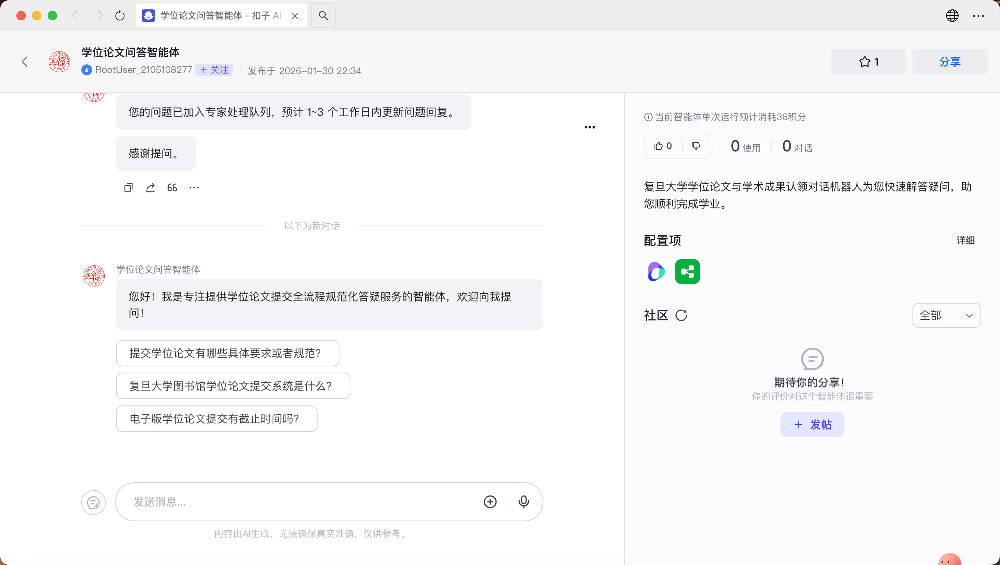
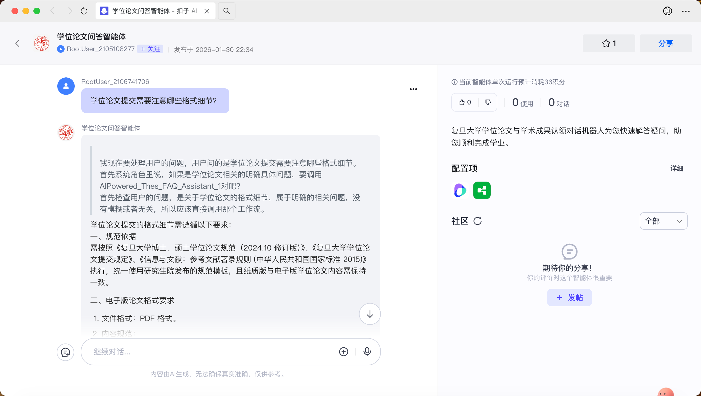
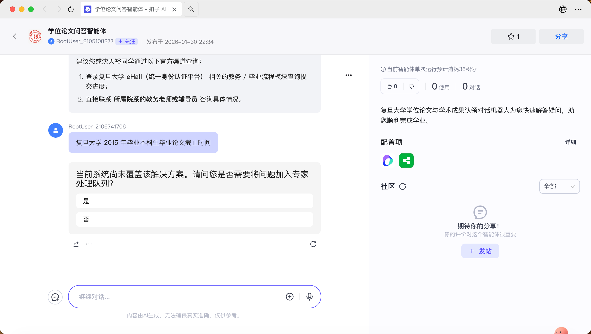
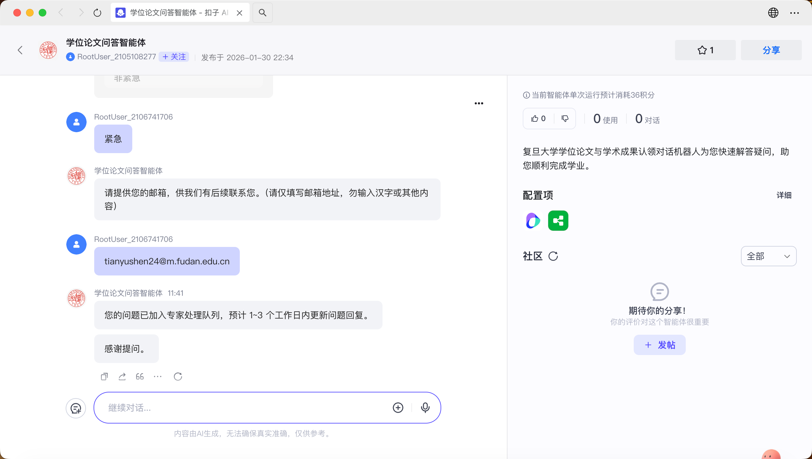
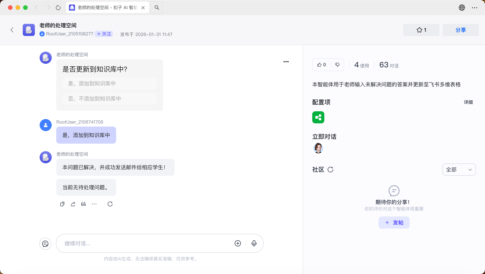
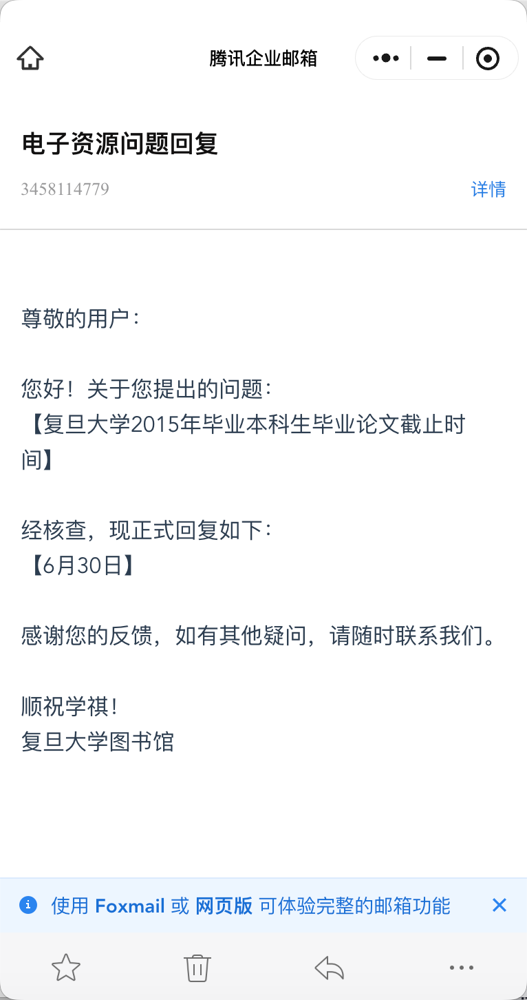
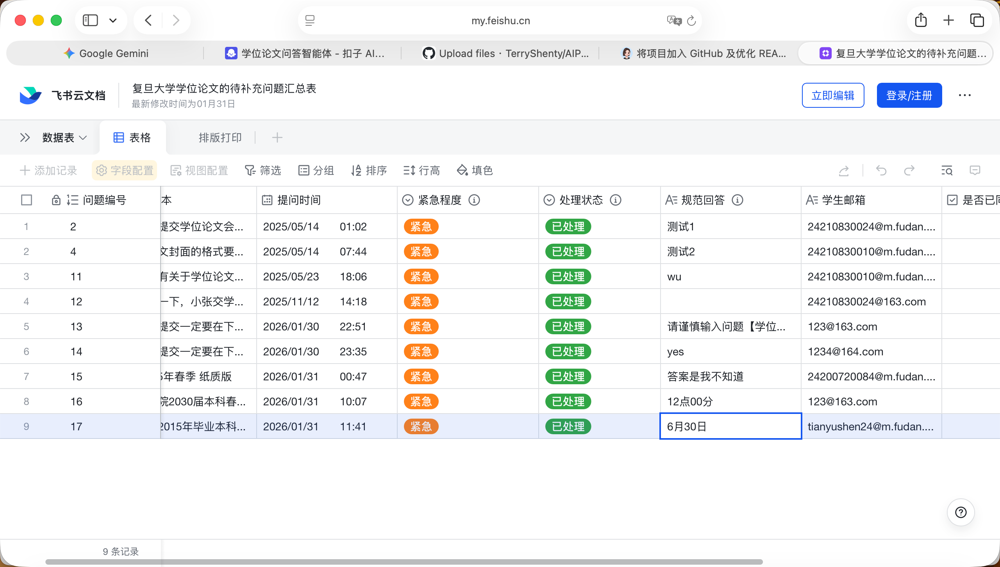
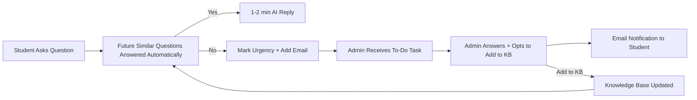

# 🎓 AI-Powered Thesis Submission FAQ Assistant
### AI-Powered Thesis Submission FAQ Assistant for Fudan University

> An intelligent campus service solution combining "Self-Service Q&A + Expert Collaboration + Knowledge Evolution" to make thesis submission inquiries more efficient and worry-free.

---

## 📌 Project Background & Core Value
### 🔍 Pain Points Addressed
During the university thesis submission period, the traditional manual consultation model faces three core issues:
- **Heavy Workload**: Over 3,000 inquiries annually, with a daily average of 30+ during peak months (May, June, December). 80% are complex questions, taking 5-30 minutes each to resolve manually.
- **Repetitive & New Challenges**: The same questions are asked more than 10 times a day. System updates generate numerous new issues that manual experience cannot quickly cover.
- **Insufficient Timeliness**: Responses are limited to working hours, failing to meet students' 24/7 inquiry needs and causing delays that affect efficiency.

### ✨ Core Value
- For Students: **Get accurate answers with zero waiting time**, solve problems outside of working hours, and quickly connect with experts for complex issues.
- For Faculty: **Reduce repetitive inquiries by 80%-90%**, focus on handling difficult problems, and benefit from an automatically iterating knowledge base without manual maintenance.
- For the University: Build a new data-driven governance model, transforming campus services from "manual response" to "intelligent prediction."

---

## 🔗 Quick Links
| Role | Access Link | Description |
|---|---|---|
| Student | [Student Agent](https://www.coze.cn/store/agent/7571829568286326824?bid=6iv6ue8kg1g0j) | No authorization needed, ask directly. |
| Admin | [Admin Agent](https://www.coze.cn/s/y0q4GOcg6uc/) | Auth Code: 1905 (for identity verification). |
| Demo | [Lark (Feishu) Doc](https://l0s0bl6jrtd.feishu.cn/base/NfyFbN7IjaDuWms9EHjcxqM9nkf?table=tbltllZDLnKW1K0E&view=vewm0vrJC6) | Quickly preview all questions and manually update their status. |

---

## 📂 Repository Structure

| Directory | Description |
| :--- | :--- |
| [**docs/**](./docs/) | Detailed user manual document and presentation slides. |
| [**prompts/**](./prompts/) | Prompt Engineering: Student Agent & Teacher Agent design documentation. |
| [**workflows/**](./workflows/) | Pictures showcasing workflows & architectures for student & teacher agent. |

---

## 🎯 Core Features
### 👨‍🎓 Student End: 24/7 Self-Service Q&A
| Feature | Description |
|---|---|
| Full-Scenario Coverage | Supports inquiries throughout the entire thesis lifecycle, including topic selection, formatting standards, submission procedures, and system operations. |
| Precise Intelligent Retrieval | Based on a RAG architecture and a structured knowledge base, the large model accurately matches answers, avoiding irrelevant responses. |
| Smart Intent Guidance | Automatically identifies non-thesis-related questions and guides users to focus on core inquiry scenarios, improving service efficiency. |
| Urgent Issue Escalation | For questions not found in the knowledge base, users can mark urgency and provide an email for automatic forwarding to the admin for follow-up. |
| History Tracking | Saves past inquiry records, making it convenient for students to review and avoid repeat questions. |
 

  
   
  Figure 1: Student-end intelligent Q&A launchpad

 

  
   
  Figure 2: Answering a question already in the knowledge base

 

  
   
  Figure 3: Handling a question not found in the knowledge base

 

  
   
  Figure 4: Setting urgency level and adding email contact

### 👩‍🏫 Admin End: Efficient Management & Knowledge Iteration
| Feature | Description |
|---|---|
| To-Do List | Displays unanswered questions centrally, sorted by "Urgency + Time," for a clear overview. |
| One-Click Reply & Notify | After an answer is entered, the system automatically generates and sends a standardized email to the student, no manual editing required. |
| Real-Time KB Updates | Optionally sync high-quality answers to the student-end knowledge base, achieving "answer once, reuse forever." |
| Full Traceability | All actions are logged in a Lark (Feishu) document, supporting data review and compliance audits. |
| Secure Access Control | A 4-digit authorization code (1905) verifies identity, protecting academic management privileges. |
 

  
   
  Figure 5: Admin verification and automatic iteration through unanswered questions in the Lark sheet

 

  
   
  Figure 6: Admin answers a question, chooses whether to add it to the knowledge base, and automatically emails the student

 

  
   
  Figure 7: Example of the automated email reply

 

  
   
  Figure 8: The answer and status are automatically updated in the Lark sheet

### 🔄 Closed-Loop Service: Seamless Flow from Self-Service to Expert

